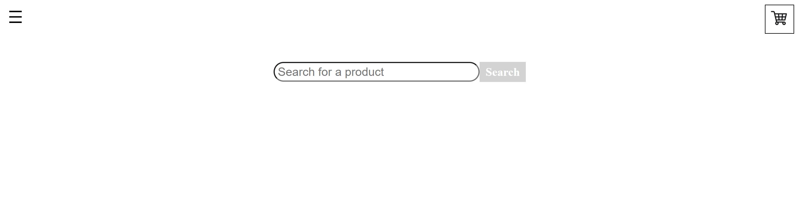

# P2_CafeAPI
## Project Description
This is a ASP.NET Core API project utilizing Entity Framework Core, an Azure SQL Database, and Angular front-end to create a Web Store Application. Store items are provided by the Rainforest API, which uses AI-powered visual page inspection to extract information from Amazon web pages. The general idea of the project was to mimic Amazon. We identified the most crucial features and set about implementing them.
## Technologies Used
C# Programming, HTML5, CSS3, TypeScript, ADO.NET Entity Framework, Testing Process/SDLC, Microsoft SQL Server, Azure DevOps Pipelines, Azure Cloud Database, Trello
## Features
### Completed
- Search for items
- View an item’s details
- Add an item to their cart
- Display their cart
- Customer can create account
- Customer can sign into their account
### In progress
- Removing an item from the cart
- Placing orders
- Viewing past orders
### Todo list
- Customer leave product review and rating 
- Customer ubmit product subscriptions (needed because not using API call which provides product description, call takes too long) 
- Administrator to monitor customer-generated content 
- Incentivize users to write professional descriptions by giving them vouchers to use on our site
## Getting started
This link, https://cafeapi-angular.azurewebsites.net/, will take you to our Web Store Application. The page should look like below:

  

## Usage
- The button in the top-left corner will toggle the navigation bar
  - You can Login or Register
- You can search for an item, click on an item, and add that item to your cart
- You can click the Cart icon in the top-right corner to display the current status of your cart
## Contributors
- Kyle Hill (team leader)
- Gulomjon Saidov
- Joshua Posada
- Christie Thammavong
## License
This project uses the following license: [MIT License](https://github.com/08162021-dotnet-uta/P2_CafeAPI/blob/main/LICENSE).
